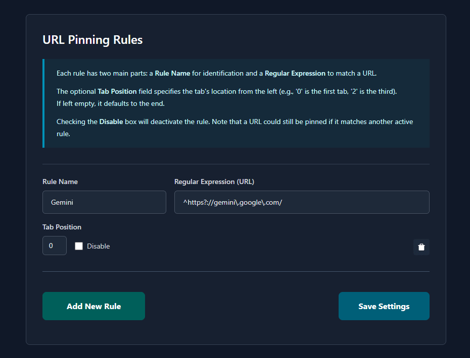

# PinTab

### A browser extension to automatically pin tabs using URL-based rules.

This plugin automatically pins tabs based on their URLs. It allows you to create multiple rules, disable specific rules, and designate where pinned tabs should be positioned.

It now supports automatically moving unpinned tabs to the far right, as well as pinning new tabs or tabs opened via the "Open link in new tab" function.

This is an updated version of the [original Pin Tab extension](https://chromewebstore.google.com/detail/pin-tab/dgldedkigbbalaioohedddpameekglma?hl=en), compatible with Manifest V3.

## Installation

Install from the Chrome Web Store (coming soon) or load manually:

1. Download the latest [release](https://github.com/schalkburger/pintab/releases/download/1.4.0.0/pintab.zip)
2. Extract the `pintab.zip` file you downloaded
3. Go to `chrome://extensions`
4. Enable "Developer mode"
5. Click "Load unpacked" and select the `pintab` folder
